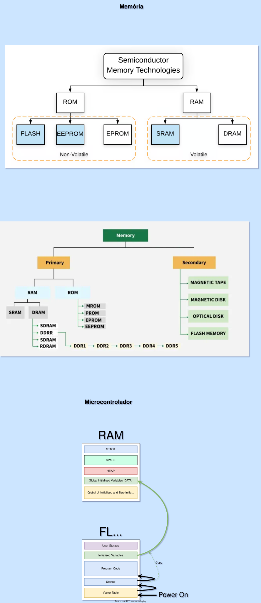
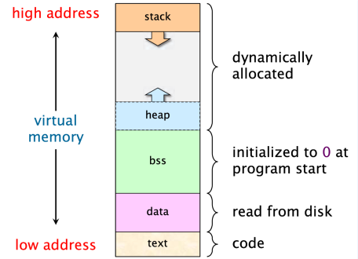
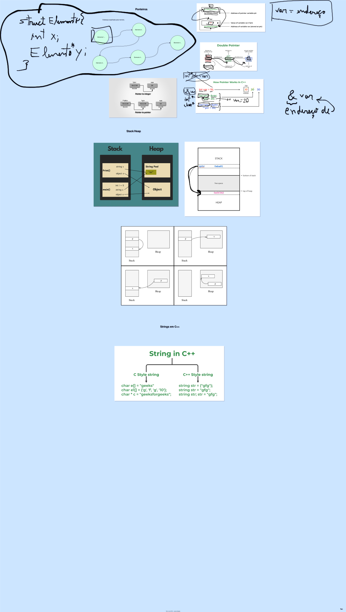

# 🧠 Tópicos Avançados de Memória e Ponteiros

Este guia aprofunda os conceitos vistos na Aula 2. Aqui vamos entender exatamente como o microcontrolador organiza seus dados e por que certas práticas (como `malloc` e `String`) são proibidas em sistemas críticos de aviônica.

## 📖 Sumário

* [**1. O Mapa de Memória (Detalhado)**](#1-🗺️-o-mapa-de-memória-detalhado)
  * [As 5 Seções da Memória](#as-5-seções-da-memória)
  * [O Pesadelo: "Stack Overflow"](#💥-o-pesadelo-stack-overflow)
* [**2. Ponteiros (O Mergulho Profundo)**](#2-📌-ponteiros-o-mergulho-profundo)
  * [Aritmética de Ponteiros](#aritmética-de-ponteiros)
  * [Ponteiros vs. Arrays](#ponteiros-vs-arrays)
  * [Ponteiros de Função](#ponteiros-de-função-callback)
* [**3. Alocação Dinâmica (O "Heap")**](#3-💥-alocação-dinâmica-o-heap)
  * [O Jeito C (`malloc`/`free`)](#o-jeito-c-malloc-e-free)
  * [O Jeito C++ (`new`/`delete`)](#o-jeito-c-new-e-delete)
  * [Por que PROIBIR em Aviônica?](#⚠️-o-problema-por-que-proibir-em-aviônica)
* [**4. `realloc`: O Perigo da Fragmentação**](#4-🔄-malloc-e-realloc-o-jeito-c-de-gerenciar-o-heap)
* [**5. `String` vs. `char[]` vs. `char*`**](#5-⚔️-o-duelo-string-vs-char-vs-char)
* [**6. Recursividade vs. Loops (Iteração)**](#6-recursividade-vs-loops-iteração)
* [**7. Diagramas e Referências**](#7-diagramas-e-referências)
  * [Memory Map](#memory)
  * [Heap vs. Stack](#heap-stack)
  * [Ponteiros](#ponteiros)

---

## 1. 🗺️ O Mapa de Memória (Detalhado)

Quando você compila e sobe um código para o Arduino, seus dados não são jogados aleatoriamente na memória. Eles são organizados em seções específicas.

Em microcontroladores AVR (como o Arduino Uno), temos dois tipos principais de memória:

1.  **Flash (Program Memory):** Onde o código vive. É não-volátil (não apaga sem energia).
2.  **SRAM (Static RAM):** Onde as variáveis vivem. É volátil (apaga ao desligar).

O uso da **SRAM** é dividido em 5 seções principais:


### As 5 Seções da Memória

1.  **Text (Code Segment):**
      * Contém as instruções do seu programa (o código binário).
      * Geralmente fica na memória **Flash**, mas constantes podem ser copiadas para cá.
      * *Exemplo:* As funções `setup()` e `loop()`.

2.  **Data (Initialized Data):**
      * Contém variáveis globais e estáticas que foram **inicializadas** com um valor diferente de zero.
      * *Exemplo:* `int pinLed = 13;` ou `static float gravidade = 9.8;`.
      * *Custo:* Ocupa espaço na Flash (para guardar o valor inicial) E na SRAM (para usar durante a execução).

3.  **BSS (Block Started by Symbol):**
      * Contém variáveis globais e estáticas que **não foram inicializadas** (ou inicializadas com zero).
      * O compilador zera essa área automaticamente na inicialização.
      * *Exemplo:* `int contador;` (O Arduino garante que começará com 0).

4.  **Heap (O "Monte"):**
      * É a área de **Alocação Dinâmica**.
      * Cresce de "baixo para cima" na memória.
      * Usada quando você chama `malloc()`, `new` ou usa objetos `String`.
      * **Perigo:** É aqui que ocorre a fragmentação.

5.  **Stack (A "Pilha"):**
      * É a área de **Memória Temporária**.
      * Cresce de "cima para baixo" na memória.
      * Armazena variáveis locais (dentro de funções), parâmetros de função e endereços de retorno.
      * Quando uma função termina, a memória da Stack é liberada automaticamente.

### 💥 O Pesadelo: "Stack Overflow"

Observe que o **Heap cresce para cima** e o **Stack cresce para baixo**. Eles compartilham o mesmo espaço livre no meio.

  * **O que é:** Se o Stack crescer demais (muitas funções aninhadas ou recursão infinita) ou o Heap crescer demais (muitos `malloc` ou `String`), um vai atropelar o outro.
  * **O Resultado:** O Stack Overflow. Seus dados são corrompidos silenciosamente. O Arduino trava, reinicia ou, pior, começa a agir de forma louca (acionando saídas aleatoriamente).

-----

## 2. 📌 Ponteiros (O Mergulho Profundo)

Já vimos que `&` pega o endereço e `*` acessa o conteúdo. Agora vamos ver o poder real.

### Aritmética de Ponteiros

Ponteiros são apenas números (endereços). Você pode somar números a eles. Mas a matemática de ponteiros é inteligente.

Se você tem um ponteiro para `int` (que ocupa 2 bytes no Uno) e faz `ptr++`, ele não avança 1 byte de memória. Ele avança **2 bytes** (o tamanho do tipo `int`).

```cpp
int numeros[] = {10, 20, 30};
int* ptr = numeros; // Aponta para o 10 (índice 0)

Serial.println(*ptr); // Imprime 10

ptr++; // Avança "uma casa de int" (2 bytes) na memória
Serial.println(*ptr); // Imprime 20!
````

### Ponteiros vs. Arrays

Em C++, arrays e ponteiros são quase a mesma coisa. O nome de um array é, na verdade, um ponteiro para o primeiro elemento.

A sintaxe `meuArray[i]` é apenas um "açúcar sintático" (atalho) para aritmética de ponteiros.

  * `meuArray[0]` é igual a `*meuArray`
  * `meuArray[3]` é igual a `*(meuArray + 3)`

Isso explica por que arrays começam em 0: você quer somar "0 casas" ao endereço inicial para pegar o primeiro item.

### Ponteiros de Função (Callback)

Você pode criar ponteiros que apontam para **código** (funções), e não para dados. Isso permite passar funções como argumentos para outras funções (muito usado em interrupções ou menus).

```cpp
// Declaração de uma função normal
void ligarMotor() { ... }

// Declaração de um ponteiro para função
// (Lê-se: ponteiro 'acao' para uma função que retorna void e não recebe nada)
void (*acao)(); 

void setup() {
    acao = ligarMotor; // Aponta para a função
    acao();            // Executa a função 'ligarMotor' através do ponteiro
}
```

-----

## 3\. 💥 Alocação Dinâmica (O "Heap")

Alocação dinâmica é pedir memória "emprestada" ao sistema durante a execução do programa.

### O Jeito C (`malloc` e `free`)

  * `malloc(tamanho)`: "Memory Allocation". Pede X bytes ao Heap. Retorna um ponteiro `void*` para o início do bloco.
  * `free(ponteiro)`: Devolve a memória ao Heap.

<!-- end list -->

```cpp
// Pede espaço para 10 inteiros
int* lista = (int*) malloc(10 * sizeof(int));

if (lista != NULL) {
    // Usa a lista...
    lista[0] = 123;
    
    // OBRIGATÓRIO devolver
    free(lista); 
}
```

### O Jeito C++ (`new` e `delete`)

É mais seguro e moderno. Chama construtores de objetos.

  * `new Tipo`: Aloca e cria.
  * `delete ponteiro`: Destrói e libera.

<!-- end list -->

```cpp
// Cria um objeto Led no Heap
Led* meuLed = new Led(13); 
meuLed->on();

delete meuLed; // Destrói o objeto
```

### ⚠️ O Problema: Por que PROIBIR em Aviônica?

Em sistemas desktop (PC), usar Heap é normal. Em microcontroladores com 2KB de RAM (como o Arduino), é **perigoso**.

#### 1\. Memory Leaks (Vazamento de Memória)

Se você fizer `malloc` (ou `new`) e esquecer de fazer `free` (ou `delete`), aquela memória fica "ocupada" para sempre.
Se isso acontecer dentro do `loop()`, sua memória RAM vai encher gota a gota até o Arduino travar (pode levar minutos ou horas).

#### 2\. Fragmentação (O "Queijo Suíço")

Este é o pior problema. Imagine a memória como uma barra de chocolate.

1.  Você aloca 10 bytes (Bloco A).
2.  Você aloca 10 bytes (Bloco B).
3.  Você libera o Bloco A.

Agora você tem um "buraco" de 10 bytes no começo.
Se você precisar alocar 15 bytes, **você não pode usar o buraco de 10 bytes**. Você terá que usar memória nova no final.
Com o tempo (especialmente usando `String`), sua memória vira um queijo suíço cheia de buracos pequenos onde nada cabe. Você pode ter 500 bytes livres no total, mas se não tiver um bloco *contínuo* de 50 bytes, seu programa trava ao tentar alocar.

> **Regra de Ouro da Equipe:**
> Evite `String`, `new` e `malloc`. Prefira arrays estáticos (`int dados[100]`) ou alocação na Stack. Se precisar de memória, reserve-a no início (`static`) e nunca a libere.

-----

## 4\. 🔄 `malloc` e `realloc`: O Jeito C de Gerenciar o Heap

No C++ do Arduino/PC, muitas vezes usamos `new` e `delete`. Mas no C "raiz" (e em muitas bibliotecas que vocês usarão), usamos `malloc`, `realloc` e `free` da biblioteca `<stdlib.h>`.

### 1\. `malloc` (Memory Allocation)

Pede ao sistema um bloco de memória de um tamanho específico (em bytes).

  * **Sintaxe:** `void* malloc(size_t size)`
  * **Uso:** Você deve multiplicar a quantidade de itens pelo tamanho do tipo (`sizeof`).

### 2\. `realloc` (Re-Allocation)

É aqui que mora o perigo e a mágica. O `realloc` tenta **redimensionar** um bloco de memória já alocado (aumentar ou diminuir).

  * **Sintaxe:** `void* realloc(void* ptr, size_t new_size)`
  * **O que ele faz:**
    1.  Tenta aumentar o bloco atual "para o lado" (se houver espaço livre contíguo).
    2.  Se **não** houver espaço ao lado, ele:
          * Aloca um **novo** bloco maior em outro lugar do Heap.
          * **Copia** os dados antigos para o novo lugar.
          * Libera (`free`) o bloco antigo automaticamente.
          * Retorna o ponteiro para o novo endereço.
Com certeza. Aqui está o código de exemplo completo e comentado, mostrando o ciclo de vida de uma alocação dinâmica usando o "jeito C" (`malloc` e `realloc`).

Você pode adicionar este bloco logo após a explicação teórica na **Seção 4** do seu **PDF 2**.

-----

### 💻 Exemplo Prático: Expandindo um Array

Este código demonstra um cenário comum: você aloca um tamanho inicial, percebe que ficou pequeno e usa `realloc` para expandir.

```cpp
#include <iostream>
#include <cstdlib> // Necessário para malloc, realloc, free

using namespace std;

void demoRealloc() {
    cout << "--- DEMO: malloc vs realloc ---" << endl;

    // 1. MALLOC: Começamos pedindo espaço para apenas 2 números
    // Tamanho = 2 * 4 bytes (int) = 8 bytes
    int* vetor = (int*) malloc(2 * sizeof(int));

    // Segurança: Sempre verifique se a memória foi concedida
    if (vetor == NULL) {
        cout << "Erro fatal: Sem memoria RAM!" << endl;
        return;
    }

    // Preenchemos o vetor inicial
    vetor[0] = 10;
    vetor[1] = 20;
    cout << "[malloc] Vetor inicial criado: " << vetor[0] << ", " << vetor[1] << endl;

    // ... O tempo passa, e percebemos que precisamos de mais espaço ...

    // 2. REALLOC: Queremos expandir para 5 números
    // O sistema tentará aumentar o bloco atual. Se não der, ele
    // cria um novo, COPIA os dados (10, 20) e apaga o antigo.
    cout << "[realloc] Tentando expandir para 5 posicoes..." << endl;

    // IMPORTANTE: Usamos um ponteiro temporário.
    // Se o realloc falhar, ele retorna NULL mas NÃO libera a memória antiga.
    // Se fizermos 'vetor = realloc(...)', perdemos o endereço original em caso de erro.
    int* tempPtr = (int*) realloc(vetor, 5 * sizeof(int));

    if (tempPtr == NULL) {
        cout << "Erro ao expandir! Memoria cheia." << endl;
        free(vetor); // Liberamos o que tinhamos antes de sair
        return;
    }

    // Sucesso! Atualizamos nosso ponteiro principal
    vetor = tempPtr;

    // Preenchemos as novas posições (índices 2, 3, 4)
    vetor[2] = 30;
    vetor[3] = 40;
    vetor[4] = 50;

    // Mostramos o resultado final
    cout << "Resultado Final: ";
    for (int i = 0; i < 5; i++) {
        cout << vetor[i] << " ";
    }
    cout << endl;

    // 3. FREE: Limpeza obrigatória
    free(vetor);
    cout << "Memoria liberada. Fim." << endl;
}

int main() {
    demoRealloc();
    return 0;
}
```

> [\!DANGER]
> **⚠️ O Perigo na Aviônica:**
> O `realloc` é o **rei da fragmentação**. Quando ele não consegue crescer no local e precisa "mudar de casa" (alocar em outro lugar e liberar o antigo), ele deixa para trás um "buraco" vazio na memória (o local antigo).
>
> Se você ficar fazendo `realloc` constantemente (como a classe `String` faz quando você adiciona caracteres), o seu Heap vira um queijo suíço cheio de buracos inutilizáveis, levando ao travamento do sistema. **Evite `realloc` em loop\!**

-----

## 5\. ⚔️ O Duelo: `String` vs. `char[]` vs. `char*`

No mundo do Arduino/C++, existem três formas de lidar com texto. Elas parecem iguais, mas por baixo do capô são inimigas mortais.

### 1\. O Vilão: `String` (Objeto)

É fácil de usar, parece Python ou Java.

  * **O que é:** Uma Classe que gerencia memória automaticamente.
  * **Onde vive:** No **Heap**.
  * **O Perigo:** Cada vez que você muda o texto (concatena, corta), ele faz um `realloc`, joga fora a memória antiga e aloca uma nova em outro lugar. **Causa fragmentação severa.**

<!-- end list -->

```cpp
String mensagem = "Voo";  // Aloca memória no Heap
mensagem += ": ";         // Re-aloca um bloco maior, libera o antigo
mensagem += 123;          // Re-aloca de novo...
```

### 2\. O Herói: `char[]` (Array/Buffer)

É o jeito "raiz" (C clássico).

  * **O que é:** Um pedaço de memória de tamanho fixo e contíguo.
  * **Onde vive:** Na **Stack** (se local) ou **BSS/Data** (se global).
  * **A Vantagem:** Tamanho fixo. Zero alocação dinâmica. Zero fragmentação. Se você declarar `char buff[50]`, você tem 50 bytes e ponto final.

<!-- end list -->

```cpp
char buffer[20];          // Reserva 20 bytes na Stack (Rápido!)
strcpy(buffer, "Voo: ");  // Copia os caracteres para lá
// Para adicionar números, usamos sprintf (ou snprintf):
sprintf(buffer, "Voo: %d", 123); 
```

### 3\. O Observador: `char*` (Ponteiro)

Ele não guarda dados, ele aponta para quem guarda.

  * **O que é:** Apenas um endereço de memória (2 bytes).
  * **O Perigo:** Ele precisa apontar para algo que existe. Se apontar para `NULL` ou memória liberada, o sistema trava.

<!-- end list -->

```cpp
const char* textoFixo = "Ola"; // Aponta para memória Flash/Estática (seguro)
char* ponteiroMovel = buffer;  // Aponta para o array que criamos acima
```

-----

## 6\. Recursividade vs. Loops (Iteração)

Muitos algoritmos podem ser resolvidos de duas formas: chamando a própria função (**Recursão**) ou usando um `for`/`while` (**Iteração**). Em sistemas embarcados, a escolha errada pode travar o foguete.

  * **Recursividade (Função chama Função):**

      * **Como funciona:** Cada vez que a função chama a si mesma, o computador aloca um novo bloco na memória **Stack** para guardar as variáveis daquela execução.
      * **O Perigo:** Se chamar muitas vezes (ou infinitamente), a Stack enche e invade a memória do sistema.
      * **Resultado:** **Stack Overflow** (Crash fatal por falta de memória).

  * **Iteração (Loops `for`/`while`):**

      * **Como funciona:** O processador apenas "pula" de volta para uma linha anterior de código. Não gasta memória extra a cada volta.
      * **O Perigo:** Se o loop for infinito, o programa trava (congela).
      * **Resultado:** **Travamento** (O programa para de responder, mas não corrompe a memória).

> **Regra de Ouro:** Em microcontroladores com pouca RAM (como o Arduino), **evite recursividade**. Prefira sempre usar loops (`while`/`for`), pois o consumo de memória é constante e previsível.

-----

# 7\. Diagramas e Referências

## Memory


## Heap-Stack


## Ponteiros
