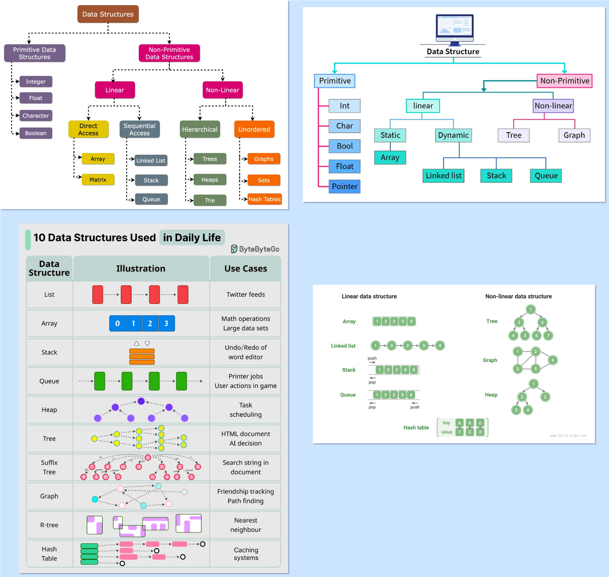
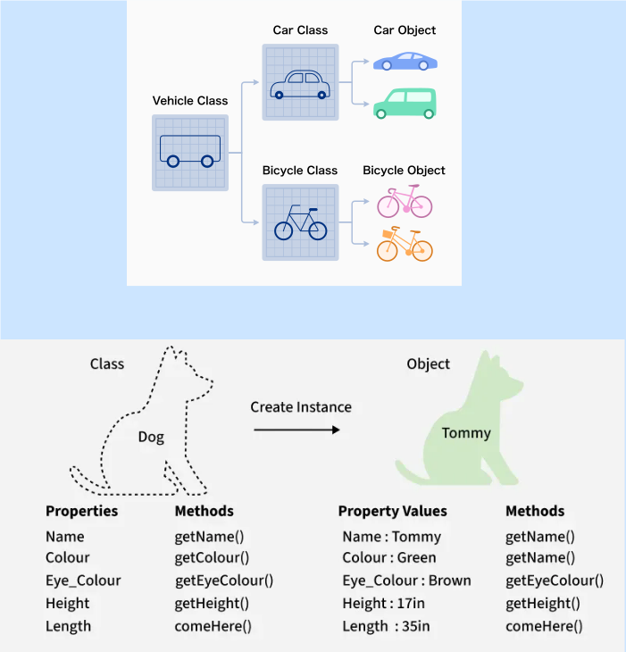

# 🏗️ Estruturas de Dados, OOP Avançado e Callbacks

Este guia leva você do nível "programador de scripts" para "arquiteto de software". Aqui veremos como organizar dados complexos, como criar sistemas flexíveis com Polimorfismo e como passar *funções* como se fossem variáveis.

## 📖 Sumário

* [**1. Estruturas de Dados (Além do Array)**](#1-🏗️-estruturas-de-dados-além-do-array)
  * [Listas (Estática vs. Dinâmica)](#listas-sequências)
  * [Pilhas (Stack) e Filas (Queue)](#pilhas-e-filas-estruturas-restritas)
  * [Estruturas Complexas (Mapas, Árvores, Grafos)](#estruturas-complexas)
* [**2. Ponteiros de Função (Callbacks)**](#2-👉-ponteiros-de-função-callbacks)
  * [O que são?](#o-conceito)
  * [Exemplo Prático: Sistema de Comandos](#exemplo-prático-sistema-de-comandos)
* [**3. OOP Avançado: Arquitetura de Voo**](#3-🏛️-oop-avançado-arquitetura-de-voo)
  * [Herança: "É UM"](#herança-reutilizando-código-é-um)
  * [Polimorfismo: O Array Genérico](#polimorfismo-a-mágica-do-c)
  * [Interfaces (Classes Abstratas)](#classes-abstratas-o-contrato)
* [**4. Diagramas e Referências**](#4-diagramas-e-referências)
    * [Data Structures](#data-structures)
    * [Classes](#classes)

-----

# 1\. 🏗️ Estruturas de Dados (Além do Array)

Estruturas de dados são "containers" inteligentes. A escolha certa define se seu código voa ou se arrasta. [link suspeito removido]

## Listas (Sequências)

### A. Lista Estática (Array / Vetor C)

  * **O que é:** Um bloco de memória fixo e vizinho.
  * **Uso em Aviônica:** **Padrão Ouro.** É previsível. Se você declara `int dados[100]`, você sabe exatamente quanto de RAM gastou.
  * **Desvantagem:** Não cresce.

### B. Lista Dinâmica (Vector)

  * **O que é:** Um array que cresce sozinho (`std::vector` no PC).
  * **Como funciona:** Quando enche, ele cria um array novo maior (no Heap), copia tudo e deleta o antigo.
  * **Uso em Aviônica:** **PERIGOSO.** O processo de crescer causa fragmentação de memória e pode travar o Arduino. Use apenas se o tamanho máximo for impossível de prever.

### C. Lista Ligada (Linked List)

  * **O que é:** Uma corrente. Cada elo (Nó) guarda um dado e um ponteiro para o próximo elo.
  * **Vantagem:** Você pode adicionar itens no meio da lista sem ter que mover todos os outros dados (só muda os ponteiros).
  * **Desvantagem:** Lento para leitura (para ler o item 50, você tem que passar pelos 49 anteriores).

<!-- end list -->

```cpp
struct No {
    int valor;
    No* proximo; // Aponta para o próximo elo
};
```

-----

## Pilhas e Filas (Estruturas Restritas)

### A. Fila (Queue) - FIFO (First In, First Out)

  * **Conceito:** Uma fila de banco. O primeiro que chega é o primeiro a ser atendido.
  * **Aplicação Real:** **Buffers de Rádio/Serial.**
      * O rádio recebe o byte 'A', depois 'B', depois 'C'.
      * Seu código deve ler 'A', depois 'B', depois 'C'.
      * Se usasse uma Pilha, leria ao contrário ('C', 'B', 'A'), o que estragaria a mensagem.

### B. Pilha (Stack) - LIFO (Last In, First Out)

  * **Conceito:** Uma pilha de pratos. Você coloca no topo e tira do topo.
  * **Aplicação Real:** **Navegação de Menus** ou **Desfazer (Ctrl+Z)**.
      * Você entra no Menu Principal -\> Configurações -\> Tela.
      * Quando aperta "Voltar", você quer sair de Tela -\> Configurações (o último que entrou é o primeiro a sair).

-----

## Estruturas Complexas

### Árvores (Trees)

  * **Conceito:** Hierarquia. Uma Raiz se divide em Galhos e Folhas.
  * **Exemplo:** O sistema de arquivos do seu PC (Pastas dentro de pastas).

### Grafos (Graphs)

  * **Conceito:** Uma rede de nós conectados livremente.
  * **Exemplo:** Uma rede de roteadores Wi-Fi (Mesh) ou rotas de voo.

[Image of tree vs graph data structure diagram]

-----

# 2\. 👉 Ponteiros de Função (Callbacks)

Esta é uma das ferramentas mais poderosas do C/C++. [link suspeito removido]

### O Conceito

Normalmente, ponteiros apontam para **variáveis** (dados). Mas funções também moram na memória.
Logo, você pode ter um ponteiro que aponta para uma **função** (código).

Isso permite que você passe "ações" como parâmetros.

**Sintaxe (A parte feia):**
`void (*nomeDoPonteiro)(tipo_parametro)`

### Exemplo Prático: Sistema de Comandos

Imagine que você quer um array de comandos, onde cada comando executa uma função diferente. Sem ponteiros de função, você precisaria de um `if/else` ou `switch` gigante. Com ponteiros, é elegante.

```cpp
// 1. Definimos algumas funções normais
void ligarLED() { Serial.println("LED LIGADO"); }
void lerSensor() { Serial.println("LENDO SENSOR..."); }
void ejetar() { Serial.println("EJETANDO!"); }

// 2. Definimos o TIPO do ponteiro (para facilitar)
// "Acao" é um ponteiro para uma função que retorna void e não recebe nada.
typedef void (*Acao)(); 

void setup() {
    Serial.begin(9600);

    // 3. Criamos um Array de Ações (Lista de funções!)
    Acao listaDeComandos[3] = {
        ligarLED,   // Índice 0
        lerSensor,  // Índice 1
        ejetar      // Índice 2
    };

    // 4. Executando as funções através do array
    // Imagine que '1' veio do rádio:
    int comandoRecebido = 1; 
    
    // Isso chama lerSensor() automaticamente!
    listaDeComandos[comandoRecebido](); 
}

void loop() {}
```

-----

# 3\. 🏛️ OOP Avançado: O Poder da Arquitetura

Na Aula 3, vimos Classes básicas. Agora vamos ver como arquitetar um sistema de voo completo.

## Herança: Reutilizando Código ("É UM")

Permite criar uma classe nova baseada em uma existente.

  * **Cenário:** Você tem 10 tipos de sensores. Todos eles têm um `id` e precisam de `calibrar()`.
  * **Solução:** Crie uma classe mãe `Sensor` e faça `SensorGPS` e `SensorIMU` herdarem dela.

<!-- end list -->

```cpp
// Classe Mãe
class Sensor {
public:
    int id;
    void ligar() { Serial.println("Ligando energia..."); }
};

// Classe Filha (Herda tudo de Sensor)
class SensorGPS : public Sensor {
public:
    float lerLatitude() { return -23.55; }
};
```

## Polimorfismo: A Mágica do C++

Polimorfismo significa "Muitas Formas". É a capacidade de tratar objetos diferentes (GPS, Barômetro) como se fossem a mesma coisa genérica (Sensor).

**O Segredo:** Usar **Funções Virtuais** (`virtual`) e **Ponteiros para a Classe Base**.

### O Problema (Sem Polimorfismo)

Você teria que ter listas separadas:

```cpp
SensorGPS listaGPS[2];
SensorBMP listaBMP[3];
// E um loop para cada lista... difícil de manter.
```

### A Solução (Com Polimorfismo)

Você cria uma lista de **Ponteiros para Sensor**, e ela aceita qualquer filho\!

```cpp
// 1. Classe Base Abstrata (O Contrato)
class Sensor {
public:
    // 'virtual' = "Filhos podem mudar isso"
    // '= 0' = "Filhos SÃO OBRIGADOS a implementar isso" (Função Pura)
    virtual void ler() = 0; 
};

// 2. Classes Filhas (A Implementação)
class SensorGPS : public Sensor {
public:
    void ler() override { Serial.println("Lendo GPS: Lat/Lon"); }
};

class SensorBMP : public Sensor {
public:
    void ler() override { Serial.println("Lendo BMP: Pressao"); }
};

// 3. O Código de Voo Genérico
Sensor* meusSensores[2]; // Array de ponteiros para a base

void setup() {
    // Posso guardar tipos diferentes no mesmo array!
    meusSensores[0] = new SensorGPS();
    meusSensores[1] = new SensorBMP();
}

void loop() {
    // O loop trata todos como "Sensor", mas cada um age do seu jeito!
    for(int i=0; i<2; i++) {
        meusSensores[i]->ler(); 
    }
    // Saída:
    // "Lendo GPS: Lat/Lon"
    // "Lendo BMP: Pressao"
    
    delay(1000);
}
```

> **Por que isso é incrível?**
> Se amanhã você comprar um sensor novo (ex: Geiger), você só cria a classe `SensorGeiger`, adiciona no array, e **não precisa mudar nenhuma linha do seu `loop`**. O sistema é extensível.

-----

# 4\. Diagramas e Referências

## Data Structures


## Classes

